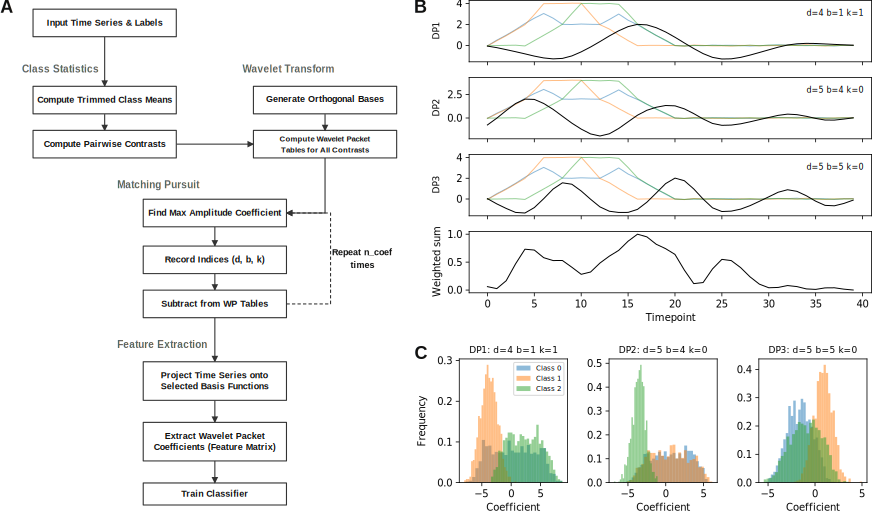

# Summary

Discriminant pursuit is a feature extraction algorithm that selects a sparse set of wavelet packet basis functions maximizing the separation between class-mean time series [@buckheit1995improved]. Given training data with class labels, the algorithm decomposes pairwise class-mean contrasts into an overcomplete wavelet packet dictionary, then greedily selects the coefficients with the largest amplitudes across all contrasts. At each step, the selected component is deflated from the dictionary, ensuring that successive basis functions capture complementary discriminative structure. The result is a compact set of time-frequency atoms, each with known temporal support and frequency content, that collectively characterize how the classes differ.

The `discriminant-pursuit` Python package provides a modern implementation of this algorithm, ported from the original Matlab code developed by Jonathan Buckheit and David Donoho at Stanford University as part of the Wavelab toolbox [@buckheit1995wavelab]. The package includes the minimal subset of Wavelab functions required for wavelet packet analysis (decomposition, impulse response, basis function construction), orthonormal filter generation for standard wavelet families, the discriminant pursuit algorithm itself, and a scikit-learn compatible transformer class.

# Statement of Need

Two developments motivate this package. First, the interpretability of time-series classifiers has become a central concern in scientific applications. Modern methods such as the ROCKET family [@dempster2020rocket; @tan2022multirocket] and deep learning architectures achieve high accuracy but provide limited insight into which temporal patterns drive classification. Researchers in neuroscience, physiology, and biomechanics often need to understand the discriminative structure — not just predict class labels — because the features themselves are the scientific finding. Classic methods like discriminant pursuit solve this problem directly, but their implementations have been inaccessible.

Second, the original discriminant pursuit code exists only as Matlab functions depending on the Wavelab toolbox, which itself requires a Matlab license and a specific historical version of the toolbox. The code has never been published as a standalone package, and the original distribution channels (FTP servers, personal web pages) have largely disappeared. This package makes the algorithm available to the scientific Python ecosystem for the first time.

The `discriminant-pursuit` package is designed for researchers who analyze temporal data and need interpretable features. The scikit-learn compatible `DiscriminantPursuit` class provides standard `fit()` and `transform()` methods, allowing the algorithm to be used as a feature extraction step in classification pipelines, cross-validation workflows, and comparative studies alongside modern methods.

# Algorithm

Entropy-based best basis selection using wavelet packet dictionaries was developed in the early 1990s [@coifman1992entropy]. This led to methods like the Local Discriminant Basis (LDB) algorithm [@saito1994local], which showed that wavelet packet dictionaries could achieve strong classification performance with simple classifiers. However, LDB and its extensions were not made publicly available.

An alternative to entropy-based best basis selection was developed using matching pursuit [@mallat1993matching]. This approach was adopted for the discriminant pursuit algorithm [@buckheit1995improved]. The method uses the wavelet packet decomposition as a dictionary and applies a greedy pursuit strategy to the class-mean contrasts. Discriminant pursuit demonstrated that a small number of wavelet packet basis functions can achieve competitive accuracy using linear discriminant analysis on some classic benchmark datasets, including the waveform dataset [@breiman1984classification]. The approach provides direct insight into the time-frequency structure that separates classes of time-series data.

The discriminant pursuit algorithm works as follows, and is depicted in @fig:waveform:

1. Compute the trimmed mean signal for each class from the training data.
2. Form all $g(g-1)/2$ pairwise contrasts between class means, where $g$ is the number of classes.
3. Decompose each contrast into the full wavelet packet table at depth $D$, producing a dictionary of $n \times (D+1)$ coefficients per contrast.
4. Across all contrasts, find the single coefficient with the largest absolute amplitude. This identifies the wavelet packet basis function — specified by its depth $d$, frequency block $b$, and translation $k$ — that maximally separates the most different pair of classes.
5. For each contrast, compute the projection of that contrast onto the selected basis function and subtract the component, deflating the dictionary.
6. Repeat steps 4–5 for the desired number of basis functions.

The extracted features are the projections of individual time series onto the selected basis functions. Because wavelet packets have compact support in both time and frequency, each feature has a direct physical interpretation: it measures the amplitude of a specific oscillatory pattern at a specific temporal location and frequency band. See @fig:waveform for an example of applying the method to the waveform dataset.



**Figure 1.** (A) Graphical depiction of the algorithm. (B) Examples of the top three wavelets (black) overlaid on the means of each class in the Breiman waveform dataset (Class 0 = blue, Class 1 = orange, Class 2 = green) and the temporal coverage of the discriminant basis functions (bottom row). Temporal coverage was calculated as the sum of the basis functions weighted by their amplitudes. (C) Feature distributions by class, calculated as the product of the wavelet coefficients and the waveform from each trial.

# Wavelet Packet Implementation

The package includes a self-contained implementation of the wavelet packet machinery required for discriminant pursuit, ported from the Wavelab toolbox:

- **Filter generation** (`make_on_filter`): Orthonormal quadrature mirror filters for Haar, Daubechies (orders 4, 6, 8, 10, 12, 14, 16, 18, 20), Symmlet (orders 4–10), and Coiflet (orders 1–5) families. Filters are normalized to unit $\ell_2$ norm.
- **Wavelet packet analysis** (`wp_analysis`): Full decomposition of a signal into the wavelet packet table at specified depth, using periodic boundary conditions.
- **Impulse response** (`wp_impulse`): Propagation of a single basis element through the packet tree, used in the deflation step.
- **Basis construction** (`make_wp`): Synthesis of a time-domain wavelet packet from its tree coordinates.

All operations use NumPy arrays and `scipy.signal.lfilter` for the convolution steps, with no compiled extensions required.

# Scikit-Learn Integration

The `DiscriminantPursuit` class wraps the core algorithm as a scikit-learn transformer (`BaseEstimator`, `TransformerMixin`). It supports standard `fit()`, `transform()`, and `fit_transform()` methods, as well as `get_params()` and `set_params()` for compatibility with `clone()` and `GridSearchCV`. The transformer can be used as a drop-in feature extraction step in any sklearn `Pipeline`:

```python
from discr_pursuit import DiscriminantPursuit
from sklearn.pipeline import make_pipeline
from sklearn.linear_model import RidgeClassifierCV

clf = make_pipeline(DiscriminantPursuit(n_coef=10), RidgeClassifierCV())
clf.fit(X_train, y_train)
```

This design ensures that when used inside cross-validation, the basis functions are learned only from the training fold, preventing data leakage.

# Validation

The package includes a test suite of 18 tests that verify:

- Filter normalization for all 22 supported filter variants (Haar, Daubechies 4–20, Symmlet 4–10, Coiflet 1–5)
- Perfect reconstruction through downsampling and upsampling (dyadic operator roundtrip) for multiple filter families
- Energy preservation at each wavelet packet decomposition level (Parseval's theorem)
- Correct impulse response structure and unit energy
- Packet table indexing roundtrip (`ix2pkt` and `pkt2ix` are exact inverses)
- Discriminant pursuit output structure, amplitude ordering, and classification accuracy on synthetic data
- Scikit-learn wrapper `fit`/`transform` consistency, pipeline compatibility with both Ridge and Random Forest classifiers, and `get_params`/`set_params` for `clone()` and `GridSearchCV`

Two tutorial notebooks demonstrate the full workflow. The first (`demo_waveform.ipynb`) applies discriminant pursuit to the Breiman Waveform-5000 benchmark dataset [@breiman1984classification], including classification with a Ridge classifier, basis function visualization, temporal coverage analysis, and feature distributions. The second (`demo_rf_cv.ipynb`) demonstrates repeated stratified k-fold cross-validation with a `DiscriminantPursuit` + `RandomForestClassifier` pipeline, with both Gini and permutation-based feature importance estimation []@strobl2007bias].

# Acknowledgements

This work was supported by NIH grant DA062121 to Mark Laubach.

The original Matlab code was written by Jonathan Buckheit and David Donoho at Stanford University as part of the Wavelab toolbox. The discriminant pursuit code was obtained from J. Buckheit in 1995 and modified and distributed with his permission. We thank the Wavelab developers for making the original toolkit available under a permissive license.

The software was developed with assistance from Claude Opus 4.5/4.6 (Anthropic) as an AI coding assistant. The nature and scope of assistance was refactoring, code generation for the plotting routines, and copy-editing. The author reviewed, edited, and validated all AI-assisted outputs and made all core design decisions.

The software is freely available at https://github.com/LaubachLab/discriminant-pursuit and archived at https://doi.org/10.5281/zenodo.18983376.

# References
